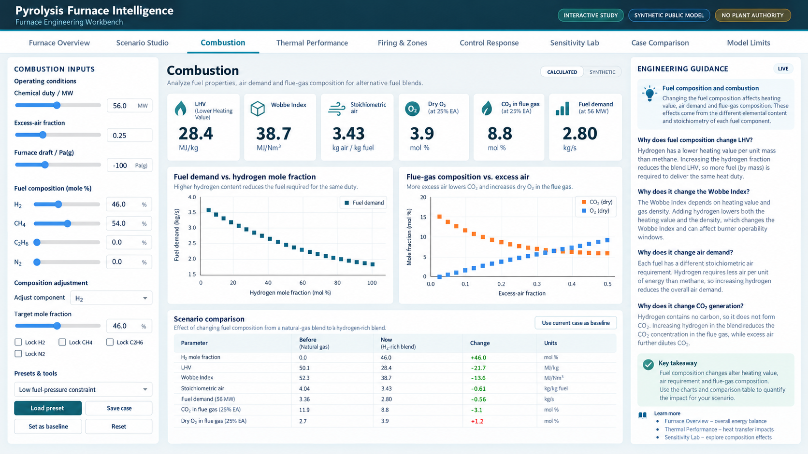

# Pyrolysis Furnace Intelligence

**Pyrolysis Furnace Intelligence** is an interactive furnace-engineering workbench that connects combustion, heat transfer and pyrolysis process behaviour in one model. I built it to make the relationships between fuel quality, excess air, firing, heat recovery and process severity visible. The public model uses generalised teaching conditions for engineering study, education and portfolio work. It is not a plant digital twin, CFD package, BMS, APC or safety system.

## Software

<p align="center">
  
</p>

The application has three connected layers. **Combustion** calculates fuel properties, LHV, Wobbe Index, stoichiometric and actual air, flue gas, CO₂ and burner loading. **Heat Transfer** follows fired duty into radiant heat, convection recovery, stack loss, box efficiency, overall efficiency and teaching heat flux. **Process** connects feed, dilution steam, coil temperatures, pressure drop, residence time, hydrocarbon partial pressure and relative time-temperature severity. The layers share one engineering state, so a change in one part of the furnace can be followed into the others.

## Engineering basis

For gaseous firing, fuel quality affects both heating value and density. Fuel flow alone therefore does not define heat release:

$$
Q_{\mathrm{fired}}=\dot{m}_{\mathrm{fuel}}\,LHV
$$

$$
WI=\frac{HV_v}{\sqrt{SG}}
$$

Combustion air is calculated from stoichiometric demand and excess air:

$$
Air_{\mathrm{actual}}=Air_{\mathrm{stoich}}(1+EA)
$$

The thermal and process layers close the linked energy balances:

$$
Q_{\mathrm{fired}}=
Q_{\mathrm{radiant}}+
Q_{\mathrm{convection}}+
Q_{\mathrm{stack}}+
Q_{\mathrm{other}}
$$

$$
Q_{\mathrm{radiant}}=
Q_{\mathrm{sensible}}+
Q_{\mathrm{reaction,residual}}
$$

These relationships let the workbench follow changes in fuel composition, excess air, feed and thermal conditions through fuel demand, flue-gas flow, CO₂, heat recovery, efficiency and process behaviour.

## Why I built it

The project grew from my experience with industrial olefin cracking furnaces and from studying combustion, heat transfer and furnace-control philosophy. Variables that appear separately on a control-room screen, including fuel composition, fuel flow, Wobbe Index, excess oxygen, flue gas, firing distribution and process temperature, are parts of one physical system. I wanted a compact tool where changing one variable shows what else moves and why.

## Scope, validation and confidentiality

The model stops where the public engineering basis becomes too weak. It does not claim CFD, local flame prediction, NOx or CO prediction, local tube heat flux, tube-metal temperature, tube life, detailed cracking yields, coke-growth prediction, dynamic PID trajectories, plant trips or safe-to-operate decisions. Conversion remains a teaching case anchor rather than an off-design kinetic prediction. More detail is available in the [heat-transfer methodology](docs/heat_transfer_methodology.md), [process methodology](docs/process_methodology.md) and [model boundaries](docs/model_boundaries.md).

Automated tests check software behaviour and physical direction, including mixture closure, fuel-air-flue-gas balances, hydrogen-rich fuel reducing carbon at constant duty, excess air increasing air and flue-gas flow without creating carbon, feed and steam moving required duty in the expected direction, and firing redistribution conserving total duty. Proprietary plant drawings and plant-specific operating data are not reproduced. Public values are generalised or synthetic where necessary.

## Windows desktop

**[Install Pyrolysis Furnace Intelligence from the Microsoft Store](https://apps.microsoft.com/detail/9NB6K57T831H?hl=en-us&gl=GB)**

The Microsoft Store version is the recommended Windows installation route. It installs the packaged desktop application directly and does not require a separate Python installation. A direct EXE installer is also available from [GitHub Releases](https://github.com/abbasrajaei/Pyrolysis-Furnace-Intelligence/releases/latest), although the direct installer is unsigned and may trigger a Windows SmartScreen warning.

To run from source with the tested Python 3.12 environment:

```bash
git clone https://github.com/abbasrajaei/Pyrolysis-Furnace-Intelligence.git
cd Pyrolysis-Furnace-Intelligence
python -m venv .venv
# activate the environment, then:
python -m pip install ".[test]"
python app/app.py
```

Open `http://127.0.0.1:8050`.

## Privacy and author

Pyrolysis Furnace Intelligence is designed to run locally and does not intentionally collect, transmit, sell or share personal information. See the [Privacy Policy](PRIVACY.md).

**Abbas Rajaei, Chemical / Process Engineer**  
This project is part of my continuing work on industrial combustion, furnace optimisation, process control and decarbonisation of energy-intensive processes.
