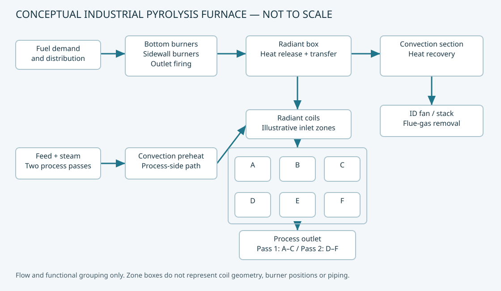
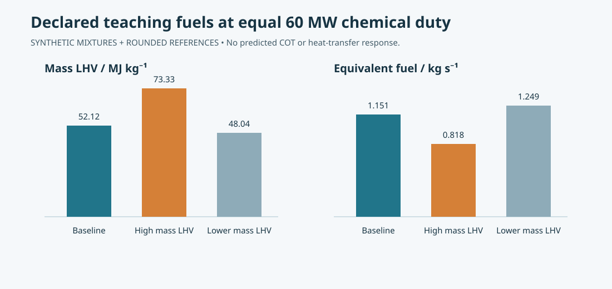
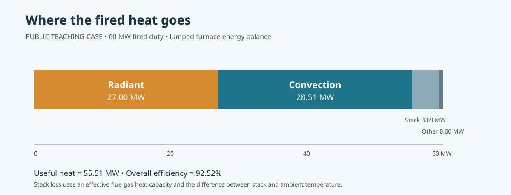
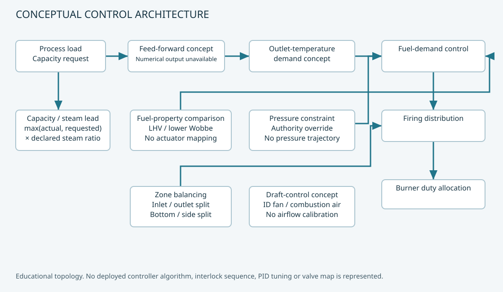
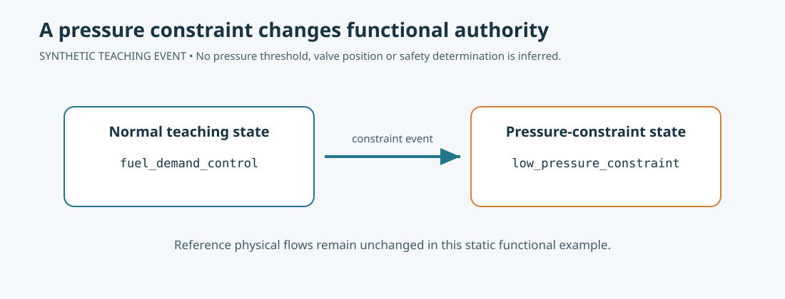
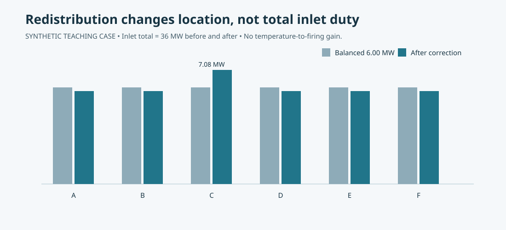
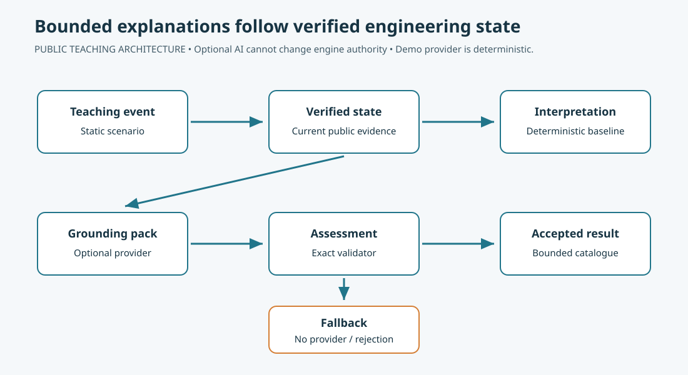

# Pyrolysis Furnace Intelligence

### Physics-Informed Combustion, Firing-Control and Engineering-Reasoning Simulator

An educational simulator for industrial pyrolysis-furnace combustion, thermal performance, firing distribution, control architecture and bounded AI-assisted engineering reasoning.

**Combustion physics + thermal accounting + firing control + scenario analysis + bounded engineering reasoning**



**Navigate:** [Model](#engineering-model) · [Fuel](#combustion-and-fuel-comparison) · [Control](#firing-control-architecture) · [Scenarios](#scenario-laboratory) · [AI](#bounded-ai-engineering-supervisor) · [Validation](#validation) · [Boundaries](#model-boundaries) · [Run](#installation)

## Interactive simulator — the actual product

This repository is **not meant to be only a README or a set of charts**. The main deliverable is the Streamlit engineering sandbox in `app/app.py`.

Run it locally:

```bash
python -m pip install ".[test]"
python -m streamlit run app/app.py
```

On the **Overview** page you can change the teaching inputs live and immediately see the calculated response:

- chemical duty
- H₂ / CH₄ / C₂H₆ / N₂ fuel composition
- excess-air fraction
- radiant and convection heat-accounting shares
- inlet/outlet firing ratio
- outlet bottom/sidewall firing ratio
- six-zone firing correction
- feed rate and steam/feed ratio
- low- or high-fuel-pressure control authority
- furnace draft as an observed input

The app recalculates fuel demand, stoichiometric and actual air, wet/dry O₂, static heat accounting, six-zone firing duty, outlet firing split, steam demand and functional control authority. Unsupported relationships remain explicitly unavailable rather than being invented.

The static figures below are documentation snapshots of selected teaching cases. **They are not the product; the interactive app is.**

## Why this project exists

Furnace operation is a constrained engineering problem: required process duty, stable combustion, balanced heat distribution and bounded equipment operation must be maintained while avoiding unnecessary firing. Burner loading, excess air, draft, process severity, tube constraints and controller interactions all matter.

This project makes those relationships inspectable. It does **not** calculate the true optimum plant state. Declared teaching inputs, explicit assumptions and unavailable results distinguish what can be calculated from what remains unknown.

## What the simulator does

| Layer | Implemented capability |
|---|---|
| Physics-informed calculator | Declared combustion chemistry, fuel properties, static heat accounting and burner loading |
| Functional firing control | Temperature selection, directional requests, conserved distribution and authority constraints |
| Scenario laboratory | Thirteen static teaching cases with deterministic explanations |
| Application | Eight Streamlit views connecting results, assumptions and limits |
| Bounded supervisor | Current-state grounding, optional provider, strict validation and fallback |

## Furnace architecture

The hero schematic connects feed and steam through convection preheat, radiant coils and the process outlet. Fuel feeds bottom, sidewall and outlet firing; flue gas transfers heat before reaching the ID fan/exhaust. Six inlet zones and two process passes are illustrative functional groups, not reproduced geometry.

## Engineering model

Every public engineering value is labelled **REFERENCE**, **CALCULATED**, **ASSUMPTION**, **SYNTHETIC** or **UNAVAILABLE**. Calculations preserve dependency categories; null values require an unavailable reason. The independent public dataset describes teaching conditions, not an operating facility.

[Technical methods](docs/methodology.md) · [Data policy](docs/data_policy.md) · [Engineering story](docs/engineering_story.md)

## Combustion and fuel comparison

For the elemental totals in one mole of a declared mixture:

$$n_{O_2,st}=C+H/4-O/2,\qquad n_{air}=4.76\,n_{O_2,st}(1+e)$$

Ideal complete combustion provides product amounts and wet/dry oxygen. Mass LHV, normal-volume LHV and lower Wobbe use explicit conventions; normal volume is defined at 273.15 K and 100 kPa absolute.

$$Q_{fired}=\dot m_f LHV_m\quad\Rightarrow\quad\dot m_f=Q_{fired}/LHV_m$$

For the **synthetic baseline mixture**, 60 MW divided by approximately 52.12 MJ/kg gives **1.151 kg/s** equivalent fuel demand. This is fixed chemical-duty arithmetic, not measured flow or predicted heat transfer.



## Thermal performance



The teaching balance is **60 MW input = 27 MW radiant + 28 MW convection + 5 MW residual**, giving 91.67% reference accounting efficiency. Residual heat is not separately identified as wall or stack loss. Control events do not recalculate radiant absorption or outlet temperature.

## Firing-control architecture



Normal demand authority can be superseded by an explicit pressure-constraint event. No plant-specific pressure threshold or valve position is introduced.



Physical distribution is distinct from controller request:

$$\sum_{i=A}^{F} f_i=1,\qquad Q_{fired}=\sum_i Q_i+Q_{outlet,bottom}+Q_{outlet,sidewall}$$

Initially all shares are 1/6. An explicit teaching correction adds 0.03 to Zone C and subtracts 0.006 from each other zone. Total inlet firing remains **36 MW**. A temperature error alone never generates that correction.



## Scenario laboratory

| Teaching case | Main distinction |
|---|---|
| Normal and fuel changes | Reference duty versus equivalent mass demand |
| Zone temperature and target bias | Changed measurement versus changed target; request versus allocation |
| Explicit redistribution | Location changes while total duty is conserved |
| Capacity increase | Steam base demand versus delivered steam |
| Pressure constraint | Authority transfer versus physical response |
| Partial/total shutdown teaching states | Functional policy versus proven isolation |
| Pass imbalance and outlet split | Proxy classification and physical duty allocation |

The [thirteen scenarios](docs/scenarios.md) are static events, not a time-integrated furnace simulation.

## Bounded AI Engineering Supervisor



Verified engineering state → sanitized grounding pack → optional provider → structured assessment → validator → accepted catalogue result or deterministic fallback.

The supervisor cannot change engine authority or create missing numerical relationships. AI is optional; the application works without a provider. The bundled **deterministic contract demo is not an AI model**. Closed-catalogue acceptance does not establish unrestricted reasoning quality or autonomous operating capability. [Supervisor contract](docs/ai_supervisor.md).

## Validation

**128 public tests passed · 0 failed · 0 skipped**

- Clean isolated installation, public examples and CLI verified.
- Application startup and eight Streamlit views verified.
- Private workspace access was not required; reads were denied during isolated execution.
- Unsupported functions are tested to remain unavailable.

These are public software/equation checks, not plant validation. [Validation scope](docs/validation.md) · [Reproducibility](docs/reproducibility.md).

## Model boundaries

| SUPPORTED | NOT CLAIMED |
|---|---|
| Ideal combustion for declared teaching mixtures | CFD or local flame prediction |
| Fuel-energy calculations and static heat accounting | Rigorous cracking or quantitative coking kinetics |
| Burner loading and firing conservation | Tube-life prediction |
| Six-zone redistribution and temperature selection | Calibrated dynamics or identified PID tuning |
| Functional authority and static scenarios | Valve-position or calibrated draft-airflow prediction |
| Deterministic explanations and bounded AI architecture | Plant safety determination, APC/BMS replacement or plant-validated optimization |

[Full model boundaries](docs/model_boundaries.md).

## Application

Overview · Thermal performance · Fuel comparison · Firing distribution · Control architecture · Scenario Lab · AI Engineering Supervisor · Model boundaries.

The figures above are publication-safe model-derived SVG portfolio figures, **not screenshots**. Browser screenshot tooling was unavailable; application execution was checked with Streamlit AppTest and HTTP startup checks.

## Repository structure

`src/` engineering and supervisor package · `data/` public inputs · `app/` dashboard · `examples/` CLI demonstrations · `tests/` public suite · `docs/` methods and boundaries · `assets/` diagrams and figures · `tools/` figure generation.

## Installation

Python 3.10+ is declared; **Python 3.12 is tested and used by the CI workflow**.

```bash
python -m venv .venv
source .venv/bin/activate
python -m pip install ".[test]"
python -m pytest -q
python -m streamlit run app/app.py --server.address 127.0.0.1
```

On Windows, activate with `.venv\Scripts\activate`. The dashboard uses repository assets; installed calculators carry their own public YAML resources.

## Example usage

```bash
python examples/fuel_comparison.py
python examples/all_scenarios.py
pyrolysis-demo --scenario zone_temperature
```

To regenerate the portfolio figures:

```bash
python -m pip install ".[figures]"
python tools/generate_portfolio_figures.py
```

## Engineering relevance

The project connects industrial combustion, heat accounting and control reasoning in a form relevant to olefin furnaces, fired heaters and energy-efficiency investigations. Reduced variability may permit less unnecessary operating margin where constraints allow, but this model does not quantify plant fuel savings, emissions reductions or run-length improvement.

## Disclaimer

Independently reconstructed educational/research software; not a plant operating tool, safety system or commercial digital twin. Diagrams are independently authored conceptual illustrations. Transient predictions are not plant-validated. [Disclaimer](docs/disclaimer.md).

## Citation / license

Author: **Abbas Rajaei**. Citation metadata: [CITATION.cff](CITATION.cff). Independently authored repository content is available under the [MIT license](LICENSE); third-party dependencies retain their own terms.
